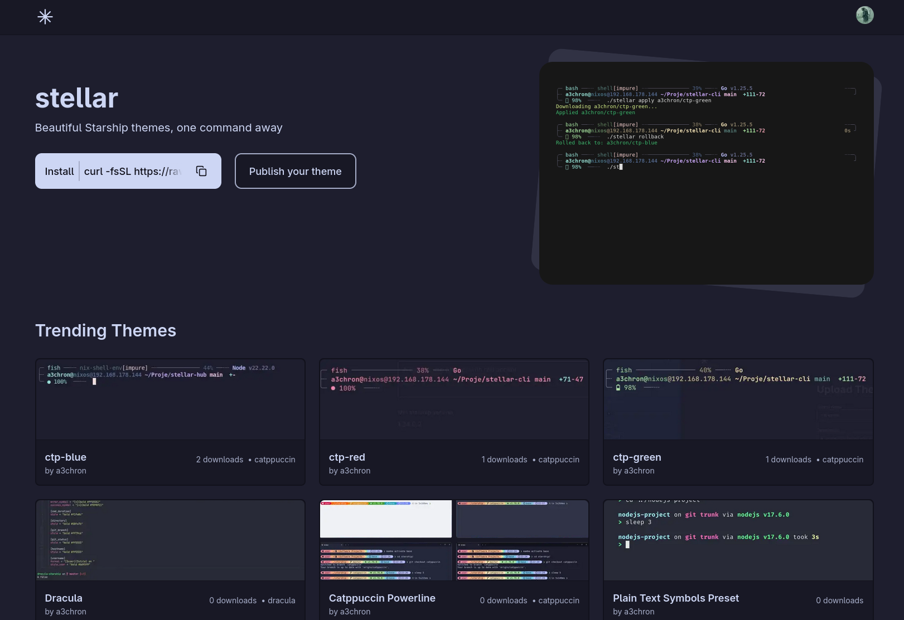
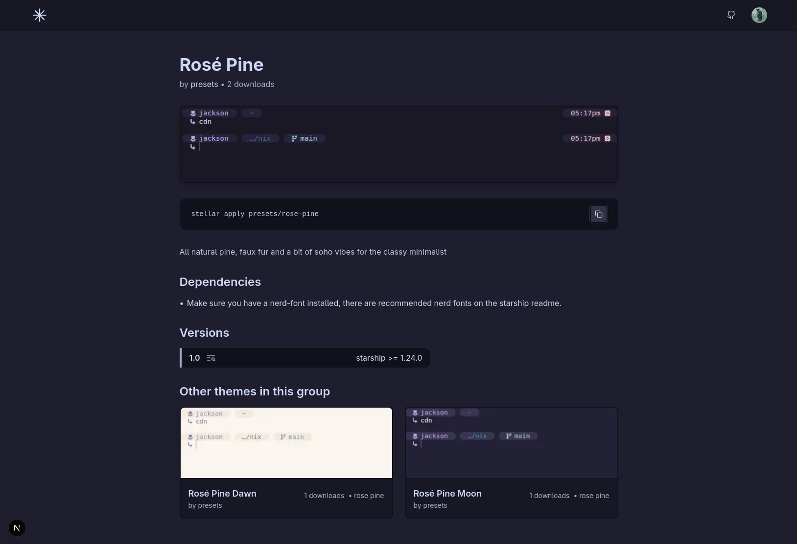

# stellar-cli
Easily get and switch between starship configs


<table>
  <tbody>
    <tr>
      <td></td>
      <td></td>
    </tr>
  </tbody>
</table>


## Installation

Just run the [install script](https://raw.githubusercontent.com/a3chron/stellar/main/install.sh) 
(which will download the binary and move it to `~/.local/bin`)
```bash
curl -fsSL https://raw.githubusercontent.com/a3chron/stellar/main/install.sh | bash
```

Check that stellar is installed with `stellar --version` or `stellar --help`, 
and search for a theme you like on the [stellar hub](https://stellar-hub.vercel.app) to apply.

For just switching between your own local configs, check out the [local configs](#local-configs) section.

Some [basic usage](#basic-usage) covered here, for more info, run `stellar --help`

<span id="windows" />

> [!NOTE]
> stellar is not yet available for windows, because stellar uses symlinks, and windows is weird with symlinks.  
> Windows users would need to either:
> - Run it with admin privileges
> - Enable Developer Mode in Windows 10+
> - (Use WSL -> not really "Windows")
> 
> which is not optimal, and means we will have to do a special case for windows, which may take some time
>
> In the meantime, you can try out the [starship theme switcher](https://github.com/a3chron/starship-theme-switcher), the first version of stellar, with a lot of features missing, but should be able to run on anything at least.

## Why use

**Before:** Getting good starship configs so far was mostly random, from someones github dotfiles, searching for something entirely else...  


**With stellar:** Find the right theme on the [stellar hub](https://stellar-hub.vercel.app) & `stellar apply <author>/<theme>`.

### Usecases

There are a few usecases for stellar:
- You want to switch your starship prompt / theme from time to time (without manually copying starship configs)
- You want to try a few different community prompts
- You are working on a theme, and need to switch around between you normal and development version often
- You have a script to change the theme of the whole system / terminal in some kind, including the starship prompt

## Basic Usage

```bash
# Apply a theme / config (downloads latest version, e.g., 1.2.toml)
stellar apply a3chron/ctp-blue

# Apply a specific version
stellar apply a3chron/ctp-blue@1.2

# Check for updates and download if available
stellar apply a3chron/ctp-blue --update

# Preview before applying (will open an extra window)
stellar preview a3chron/ctp-red

# List cached themes
stellar list

# Show current theme
stellar current

# Get theme info
stellar info a3chron/ctp-green

# Clean cache (keep current)
stellar clean

# Remove all versions of a theme
stellar remove a3chron/ctp-green

# Remove specific version only
stellar remove a3chron/ctp-green@1.0

# Rollback to previous theme
stellar rollback

# Update CLI
stellar update
```

### Stellar Hub

You can see all available community themes at the [stellar hub](https://stellar-hub.vercel.app).

#### Publishing Your Themes

I am working on getting a `stellar publish` command, but currently you will have to publish your theme at [the upload form](https://stellar-hub.vercel.app/upload).

If you want to update a theme, you can do so in your stellar hub settings, either "Edit Metadata" (The pencil icon), or "Update" (The upload icon), 
with beeing able to update either metadata like the theme name, description, prerequesites etc., or upload a new config version with version notes.

## Local configs

### Automatic backup of your original config

When you first use `stellar apply`, if you have an existing `~/.config/starship.toml` that's not managed by stellar, it will be automatically backed up to `~/.config/stellar/<username>/backup/1.0.toml` before creating the symlink.

This ensures your carefully crafted config is never lost :) You can apply it anytime with:
```bash
stellar apply <username>/backup
```

You can also rename the backup folder to give it a proper theme name:
```bash
mv ~/.config/stellar/<username>/backup ~/.config/stellar/<username>/my-custom-theme
stellar apply <username>/my-custom-theme
```

### Switching between local configs

You can just put your own configs under `~/.config/stellar/<your-username>/<your-theme>/1.0.toml`,
and then switch to them using `stellar apply <your-username>/<your-theme>`.

> [!NOTE]
> The `/<your-username>` is not needed, you can actually use whatever you would like, i.e. `/local`, `/dev` or similar,
> including existing usernames (like yours, if you also publish themes), just create an extra folder for your theme

### Customizing themes

You can similarily copy one existing downloaded theme to the `stellar/<your-username>` folder, edit it,
and then switch to it using `stellar apply ...`.

> [!NOTE]
> @ here again, you don't need `/<your-username>`, so you can theoretically just copy for example
> `a3chron/ctp-red/1.0.toml` to `a3chron/dev/1.0.toml` or any other folder name

Because stellar is using a symlink to the currently selected config file, you get hot-reload as well for editing configs, just like with the usualy `starship.toml`.

## Contributing

All contributions are welcome :)  
The easiest way to contribute is to [upload you own starship config](https://stellar-hub.vercel.app/upload) for other to use ;)

Please use [conventional commits](https://www.conventionalcommits.org/) for PRs,
and check for lint errors with `golangci-lint run` (included in the flake).

### vhs

To record a vhs video just run:
```bash
vhs demo.tape
```

For nix users:
```bash
nix-shell -p vhs
```

## Troubleshooting

### "Theme not found online, using local cache"

This message appears when stellar cannot reach the stellar-hub API. Possible reasons:

- **No internet connection** - stellar will use your locally cached version of the theme
- **Theme was deleted from the hub** - if you previously downloaded it, your local copy still works
- **Theme was renamed in the hub** - if you previously downloaded it, your local copy still works, you can search for the theme in the hub going to `/<username>` in the hub (usernames cannot be changed (yet))
- **Local-only theme** - if you created the theme manually in `~/.config/stellar/`, this is expected behavior

This is usually not a problem - stellar will use whatever version you have cached locally.

### "Theme not found: author/theme (not available online and no local cache)"

This error means the theme doesn't exist anywhere:
- Check if you typed the theme name correctly
- The theme may have been removed from stellar-hub
- For local themes, make sure you created the folder at `~/.config/stellar/<author>/<theme>/` with a `.toml` file

## TODOs

- [ ] Add light / dark theme distinction, add filter in hub
- [ ] Allow removing several themes at once: `stellar remove a3chron/ctp-green a3chron/ctp-red`
- [ ] **`stellar publish` command**: Upload local themes directly to stellar-hub
  - Challenge: Need to implement CLI authentication (OAuth flow with browser redirect or API keys)
  - Would read from `~/.config/stellar/<author>/<theme>/<version>.toml`
  - Interactive prompts for metadata (name, description, screenshot, etc.)
  - Skip complex fields initially (e.g., color scheme selection - add later)
- [ ] **`stellar update <theme>` command**: Update an existing theme on stellar-hub with a new version
  - Requires authentication (same challenge as publish)
  - Upload new version of already published theme
  - Interactive prompts for version notes, dependencies, etc.
- [ ] Add progress bars for downloads
- [ ] Add tests
- [ ] Preview: fix bash formatting
- [ ] Preview: maybe cache un /tmp, os not downloading two times, but also not saving previewed themes in stllar cache 

<br />

<p align="center"><a href="https://github.com/a3chron/stellar/blob/main/LICENSE">
</a></p>
