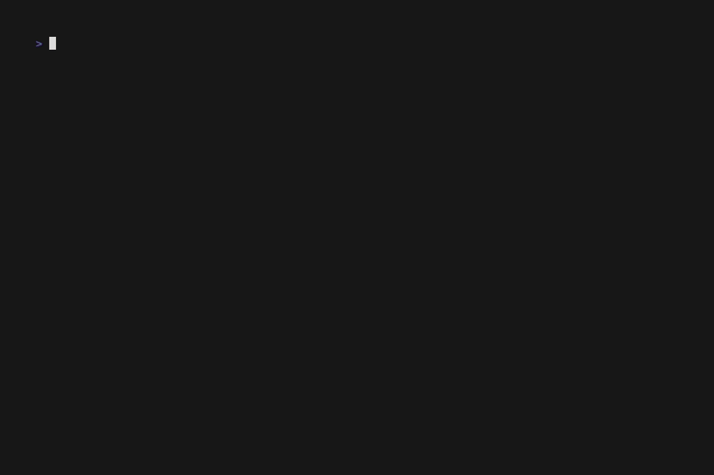
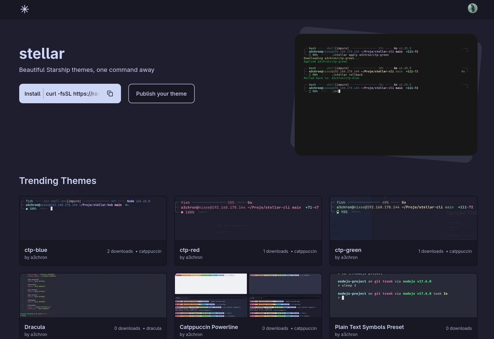
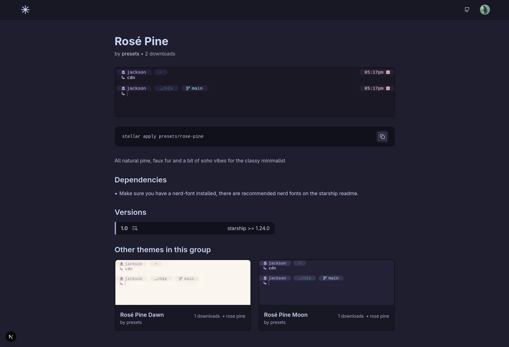

# stellar-cli
Easily get and switch between starship configs


<table>
  <tbody>
    <tr>
      <td></td>
      <td></td>
    </tr>
  </tbody>
</table>


## Installation

### Linux / macOS

Just run the [install script](https://raw.githubusercontent.com/a3chron/stellar/main/install.sh) 
(which will download the binary and move it to `~/.local/bin`)
```bash
curl -fsSL https://raw.githubusercontent.com/a3chron/stellar/main/install.sh | bash
```

### Windows

Run the [PowerShell install script](https://raw.githubusercontent.com/a3chron/stellar/main/install.ps1) 
(which downloads the binary to `%LOCALAPPDATA%\stellar\bin` and adds it to your PATH)
```powershell
irm https://raw.githubusercontent.com/a3chron/stellar/main/install.ps1 | iex
```

Check that stellar is installed with `stellar --version` or `stellar --help`, 
and search for a theme you like on the [stellar hub](https://stellar-hub.vercel.app) to apply.

For just switching between your own local configs, check out the [local configs](#local-configs) section.

Some [basic usage](#basic-usage) covered here, for more info, run `stellar --help`

<span id="windows" />

> [!NOTE]
> On Linux and macOS, stellar applies a theme by **symlinking** `~/.config/starship.toml` to the cached
> config, which gives you hot-reload while editing local configs.
>
> Windows is bad at symlinks (they need Developer Mode or admin privileges), so on Windows stellar
> **copies** the theme file over `starship.toml` instead. Everything works the same, except
> editing a local theme file, it does **not** live-update `starship.toml` (it's a copy, not a link). Just
> re-run `stellar apply <author>/<theme>` after editing.
>
> You can force copy mode anywhere (e.g. for testing) by setting `STELLAR_APPLY_MODE=copy`.

### Shell completion

stellar ships tab completion for commands, flags, and theme identifiers
(`author/slug@version`). Candidates come from your local theme cache, so
completion is always instant and works offline. If you want hub themes
suggested too, set `STELLAR_COMPLETION_ONLINE=1` (adds up to ~2s of network
lookup per completion; degrades silently to local-only when offline).

```bash
# bash
stellar completion bash > ~/.local/share/bash-completion/completions/stellar

# zsh
stellar completion zsh > "${fpath[1]}/_stellar"

# fish
stellar completion fish > ~/.config/fish/completions/stellar.fish

# powershell (add to $PROFILE)
stellar completion powershell | Out-String | Invoke-Expression
```

## Why use

**Before:** Getting good starship configs so far was mostly random, from someones github dotfiles, searching for something entirely else...  


**With stellar:** Find the right theme on the [stellar hub](https://stellar-hub.vercel.app) & `stellar apply <author>/<theme>`.

### Usecases

There are a few usecases for stellar:
- You want to switch your starship prompt / theme from time to time (without manually copying starship configs)
- You want to try a few different community prompts
- You are working on a theme, and need to switch around between your normal and development version often
- You have a script to change the theme of the whole system / terminal in some kind, including the starship prompt

## Basic Usage

```bash
# Apply a theme / config (uses latest local version or downloads latest version, e.g., 1.2.toml)
stellar apply a3chron/ctp-blue

# Apply a specific version
stellar apply a3chron/ctp-blue@1.2

# Check for updates and download if available
stellar apply a3chron/ctp-blue --update

# Preview before applying (will open an extra window)
stellar preview a3chron/ctp-red

# List cached themes
stellar list

# Show current theme
stellar current

# Get theme info
stellar info a3chron/ctp-green

# Clean cache (keep current)
stellar clean

# Remove all versions of a theme
stellar remove a3chron/ctp-green

# Remove specific version only
stellar remove a3chron/ctp-green@1.0

# Rollback to previous theme
stellar rollback

# Update CLI
stellar update
```

### Stellar Hub

You can see all available community themes at the [stellar hub](https://stellar-hub.vercel.app).

#### Publishing Your Themes

I am working on getting a `stellar publish` command, but currently you will have to publish your theme at [the upload form](https://stellar-hub.vercel.app/upload).

If you want to update a theme, you can do so in your stellar hub settings, either "Edit Metadata" (The pencil icon), or "Update" (The upload icon), 
with beeing able to update either metadata like the theme name, description, prerequesites etc., or upload a new config version with version notes.

## Local configs

### Automatic backup of your original config

When you first use `stellar apply`, if you have an existing `~/.config/starship.toml` that's not managed by stellar, it will be automatically backed up to `~/.config/stellar/<username>/backup/1.0.toml` before creating the symlink.

Backups are versioned. If stellar later finds another unmanaged `starship.toml` (for example one you restored or hand-wrote), it backs that up too as `2.0.toml`, then `3.0.toml`, and so on, so an earlier backup is never overwritten.

This also works in copy mode (the Windows default): if you edit the applied `starship.toml` directly, stellar notices the file no longer matches the theme it applied and backs up your edits before applying the next theme.

Stellar recognizes its own applied file by a checksum recorded in `~/.config/stellar/config.json`, independent of apply mode (symlink or copy) or OS. This means editing a cached theme file directly and re-applying it, or running `stellar clean`/`stellar clean --all` and then applying another theme, never creates a spurious backup, only a config file you actually hand-edited yourself gets preserved.

`stellar clean` (with or without `--all`) never deletes your backups either. 
They're preserved automatically and only removed if you explicitly run `stellar remove <username>/backup`.

This ensures your carefully crafted config is never lost :) You can apply the newest backup anytime with:
```bash
stellar apply <username>/backup
```

To restore a specific one, for instance your very first original config, just pin the version:
```bash
stellar apply <username>/backup@1.0
```

You can also rename the backup folder to give it a proper theme name:
```bash
mv ~/.config/stellar/<username>/backup ~/.config/stellar/<username>/my-custom-theme
stellar apply <username>/my-custom-theme
```

### Switching between local configs

You can just put your own configs under `~/.config/stellar/<your-username>/<your-theme>/1.0.toml`,
and then switch to them using `stellar apply <your-username>/<your-theme>`.

> [!NOTE]
> The `/<your-username>` is not needed, you can actually use whatever you would like, i.e. `/local`, `/dev` or similar,
> including existing usernames (like yours, if you also publish themes), just create an extra folder for your theme

### Customizing themes

You can similarily copy one existing downloaded theme to the `stellar/<your-username>` folder, edit it,
and then switch to it using `stellar apply ...`.

> [!NOTE]
> @ here again, you don't need `/<your-username>`, so you can theoretically just copy for example
> `a3chron/ctp-red/1.0.toml` to `a3chron/dev/1.0.toml` or any other folder name

Because stellar is using a symlink to the currently selected config file, you get hot-reload as well for editing configs, just like with the usual `starship.toml`.

> [!NOTE]
> On Windows stellar copies the config instead of symlinking it (see the [Windows note](#windows)),
> so editing a local theme file does **not** hot-reload, you'll have to re-run `stellar apply <author>/<theme>` after editing.

## Troubleshooting

### "Theme not found online, using local cache"

This message appears when stellar cannot reach the stellar-hub API. Possible reasons:

- **No internet connection** - stellar will use your locally cached version of the theme
- **Theme was deleted from the hub** - if you previously downloaded it, your local copy still works
- **Theme was renamed in the hub** - if you previously downloaded it, your local copy still works, you can search for the theme in the hub going to `/<username>` in the hub (usernames cannot be changed (yet))
- **Local-only theme** - if you created the theme manually in `~/.config/stellar/`, this is expected behavior

This is usually not a problem - stellar will use whatever version you have cached locally.

### "Theme not found: author/theme (not available online and no local cache)"

This error means the theme doesn't exist anywhere:
- Check if you typed the theme name correctly
- The theme may have been removed from stellar-hub
- For local themes, make sure you created the folder at `~/.config/stellar/<author>/<theme>/` with a `.toml` file

## Contributing

All contributions are welcome :)  
The easiest way to contribute is to [upload your own starship config](https://stellar-hub.vercel.app/upload) for other to use ;)

Please use [conventional commits](https://www.conventionalcommits.org/) for PRs,
and check for lint errors with `golangci-lint run` (included in the flake).

### vhs

To record a vhs video just run:
```bash
vhs demo.tape
```

For nix users:
```bash
nix-shell -p vhs
```

### Testing

#### Running Tests

From the `stellar-cli` directory:

```bash
# Enter development environment (NixOS)
nix develop

# Run E2E tests (recommended - tests all CLI functionality)
./run-tests.sh -e

# Run E2E tests against production API
./run-tests.sh -ep

# Run unit tests (internal modules)
./run-tests.sh -u

# Run all tests
./run-tests.sh -a

# Interactive menu
./run-tests.sh
```

#### Test Types

- **E2E tests**: Test complete user workflows (apply, remove, list, etc.). These are the primary tests and cover all CLI functionality.
- **Unit tests**: Test internal modules (API client, theme parser). Less important, mainly for edge cases.

#### Contributing Tests

When adding new CLI features, please add corresponding E2E tests in `cmd/e2e_test.go`. This ensures the feature works from a user's perspective. Unit tests are not needed unless the feature has complex internal logic.

## TODOs

- [x] Allow removing several themes at once: `stellar remove a3chron/ctp-green a3chron/ctp-red`
- [x] Preview: maybe cache in /tmp, os not downloading two times, but also not saving previewed themes in stellar cache
- [x] Add tests
- [x] **Windows support**: apply themes by copying instead of symlinking (`STELLAR_APPLY_MODE`), Windows release binary, PowerShell installer, and `stellar update`

- [ ] **Preview: fix bash formatting**
- [ ] **`stellar preview` on Windows**: `cmd/preview.go` only spawns terminals on macOS/Linux and returns "unsupported platform" on Windows. Needs a Windows Terminal / PowerShell branch that opens a shell with `STARSHIP_CONFIG` set.
- [ ] **Windows packaging**: consider scoop/winget packaging (leftover `stellar.exe.old` from self-update is already cleaned up on the next run).
- [ ] **CI test job**: the release workflow runs no `go test` today; add one (ideally with a `windows-latest` runner) to guard the copy path natively.
- [ ] **`stellar publish` command**: Upload local themes directly to stellar-hub
  - Challenge: Need to implement CLI authentication (OAuth flow with browser redirect or API keys)
  - Would read from `~/.config/stellar/<author>/<theme>/<version>.toml`
  - Interactive prompts for metadata (name, description, screenshot, etc.)
  - Skip complex fields initially (e.g., color scheme selection - add later)
- [ ] **`stellar update <theme>` command**: Update an existing theme on stellar-hub with a new version
  - Requires authentication (same challenge as publish)
  - Upload new version of already published theme
  - Interactive prompts for version notes, dependencies, etc.
- [ ] Add progress bars for downloads
- [ ] Get stellar into nix pckgs / nixify

<br />

<p align="center"><a href="https://github.com/a3chron/stellar/blob/main/LICENSE">
</a></p>
